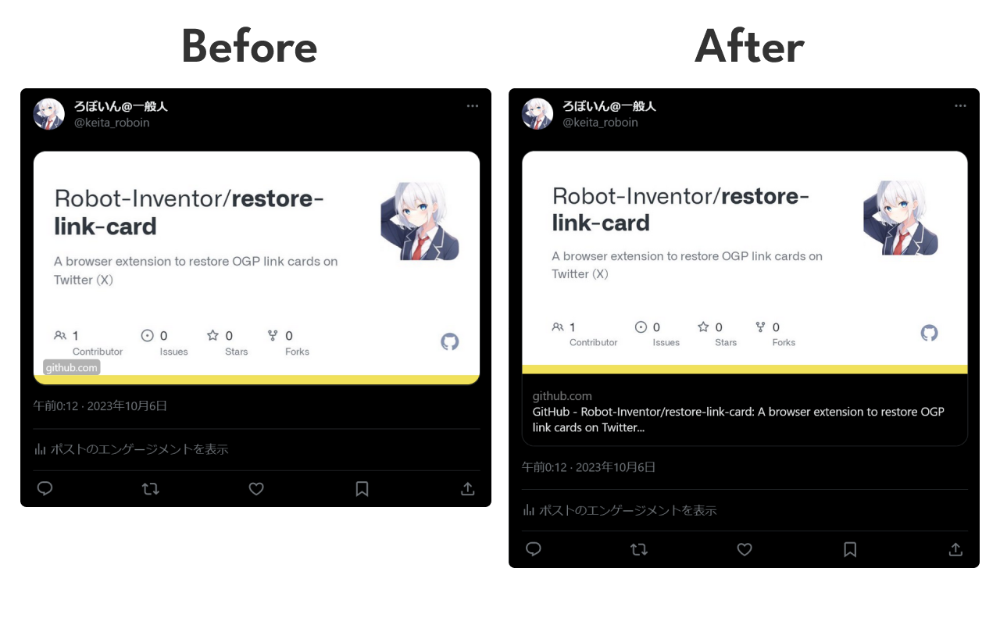

# Restore Link Card

A browser extension to restore OGP link cards on Twitter (X).

Twitter (X) removed headings from links in tweets (posts) on October 4, 2023. This extension restores the removed headlines and restores the previous ease of use.

## License

This extension is licensed under the MIT License.

The extension's logo was created by combining Google's Material Symbols.
